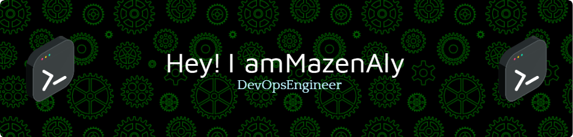

# Hi there, I'm Mazen Volkov! 👋

## About Me 🚀

I am a dedicated DevOps Engineer & Commander of Cloud Operations with over 5 years of experience managing infrastructure, automating deployments, and leading the digital transformation of tech battalions. I specialize in building resilient systems using modern DevOps tools and practices.

- 🌱 Currently learning: **[GitOps, and advanced Kubernetes patterns]**
- 🔭 Working on: **[Automated CI/CD pipelines using Jenkins and Terraform modules for multi-cloud infra]**
- 🌍 Languages: **[Bash, Python and English]**
- 📫 How to reach me: **[(https://www.linkedin.com/in/mazenalbadawy/)]**
- ⚡ Fun fact: **[I once deployed a full-stack app from a Linux command line in under 15 minutes—during a network drill!]**

## My Skills 🧠

## Get in Touch 📬

- **[Personal Website / Blog]**(your_website_or_blog_link)
- **[LinkedIn]**([your_linkedin_profile_link](https://www.linkedin.com/in/mazenalbadawy/))

